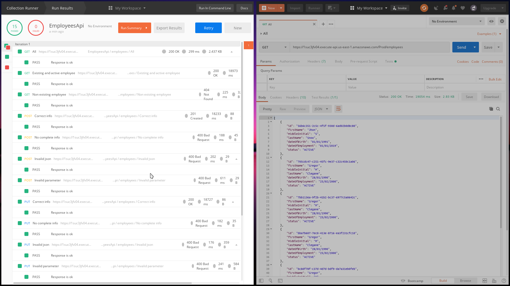

<!-- PROJECT SHIELDS -->
[![Build Status][build-shield]]()
[![Contributors][contributors-shield]]()


<!-- PROJECT LOGO -->
<br />
<p align="center">

  <h3 align="center">Serverless Employees Api</h3>

  <p align="center">
    A serverless approach to an Employees api!
    <br />
    <a href="https://documenter.getpostman.com/view/7170007/S1TR4zZz"><strong>Explore the docs »</strong></a>
    <br />
    <br />
    <a href="https://github.com/angel3071/employees-api-rest/issues">Report Bug</a>
    ·
    <a href="https://github.com/angel3071/employees-api-rest/issues">Request Feature</a>
  </p>
</p>


<!-- ABOUT THE PROJECT -->
## About The Project


There are always several different ways to solve a problem in this situation I
see the oportunity and I take the risk, I hope you to like it.

The proposed solution to the requiriement was to develop a serverless
implementation of the Employees api, all the specification on the request was
accomplished and some other cool stuff was involved on the process.

Some reasons to choose a serverless approach:
* Pricing!
* Zero system administration
* Scalable!

And with the Infraestructure as Code approach everything its super easy to move
around, deploy and take care of the services configurationd and maintanence on
the git respository itself.


### Built With
On a global point of view:
* [API Gateway](https://aws.amazon.com/es/api-gateway/)
* [AWS Lambda](https://aws.amazon.com/es/lambda/)
* [DynamoDB](https://aws.amazon.com/es/dynamodb/)
* [AWS CloudFormation](https://aws.amazon.com/es/cloudformation/)

On the Code point of view:
* Java8
* Gradle
* aws sdk
* Jackson


<!-- GETTING STARTED -->
## Getting Started

This api its ready for you to deploy it, you just need an aws account (obviously)
To get your own copy up and running follow these simple example steps.

### Prerequisites

This is an example of how to list things you need to use the software and how to install them.
#### Tools
- gradle
- aws cli

#### S3 Bucket for code artifacts
```sh
aws s3 mb s3://{whetever-you-want-to-call-your-bucket}
```

### Deployment

1. Clone the repo
```sh
git clone https://github.com/angel3071/employees-api-rest
```
2. Build
```sh
gradle build
```
4. Package
```sh
aws cloudformation package --template-file samTemplate.yaml --s3-bucket {whetever-your-bucket-its-named} --output-template-file outputSamTemplate.yaml
```
5. Deploy
```sh
aws cloudformation deploy --stack-name EmployeesApi --template outputSamTemplate.yaml --capabilities CAPABILITY_IAM
```

On the deployment a custom resource its created and it loads some example data
to de databse to be ready to testing.


<!-- USAGE EXAMPLES -->
## Usage (the api its actually already live!)

All the possible methods are described on the documentation, please refer to
them, a little example:

```sh
curl --location --request GET "https://1suc3jfv04.execute-api.us-east-1.amazonaws.com/Prod/employees/56b6c351-2c5c-4f5f-930d-6ad02b0d8c80"

{
    "id": "56b6c351-2c5c-4f5f-930d-6ad02b0d8c80",
    "firstName": "Jhon",
    "middleInitial": "S",
    "lastName": "Snow",
    "dateOfBirth": "01/01/1991",
    "dateOfEmployment": "01/01/2019",
    "status": "ACTIVE"
}
```
Here you have the actual [swagger definition for postman](misc/EmployeesApi-Prod-swagger-postman.json), go and try all the
different methods.

_For more examples, please refer to the [Documentation](https://documenter.getpostman.com/view/7170007/S1TR4zZz)_

In this repo you have the Postman collection with some use cases and actually a
set of simple but contundend automated tests:





<!-- CONTACT -->
## Contact

Angel Ramírez - [angel3071](https://github.com/angel3071) -
angramcab@gmail.com

Project Link: [https://github.com/angel3071/employees-api-rest](https://github.com/angel3071/employees-api-rest)


<!-- MARKDOWN LINKS & IMAGES -->
[build-shield]: https://img.shields.io/badge/build-passing-brightgreen.svg?style=flat-square
[contributors-shield]: https://img.shields.io/badge/contributors-1-orange.svg?style=flat-square
[license-shield]: https://img.shields.io/badge/license-MIT-blue.svg?style=flat-square
[license-url]: https://choosealicense.com/licenses/mit
[linkedin-shield]: https://img.shields.io/badge/-LinkedIn-black.svg?style=flat-square&logo=linkedin&colorB=555
[linkedin-url]: https://linkedin.com/in/othneildrew
[product-screenshot]: https://raw.githubusercontent.com/othneildrew/Best-README-Template/master/screenshot.png
